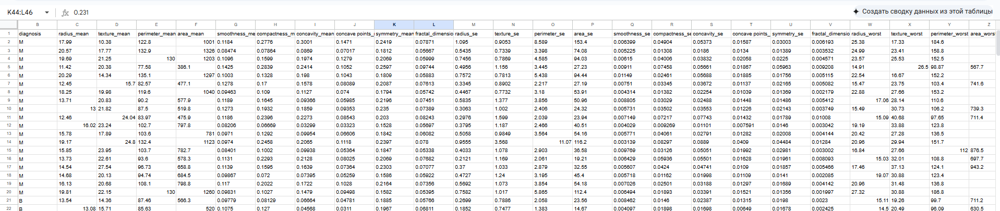
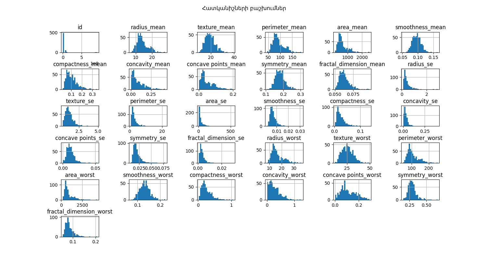
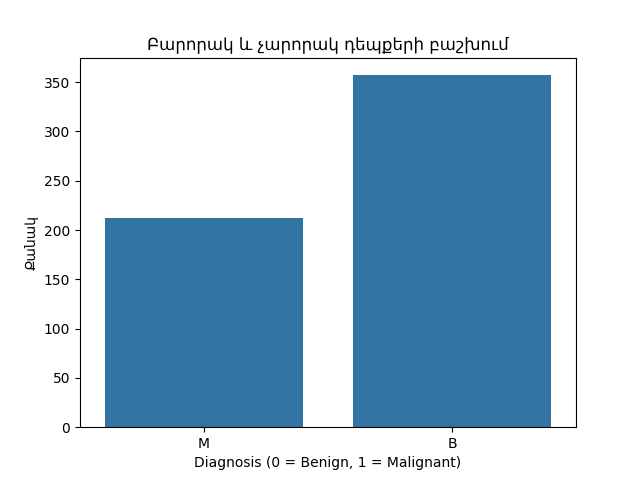
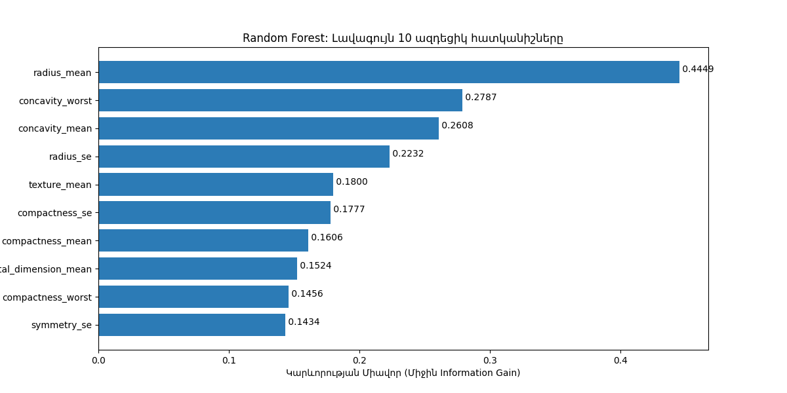

# 🧬 Breast Cancer Prediction Using a Fully Custom Random Forest Classifier  
### *A Complete From-Scratch Machine Learning Implementation (No sklearn trees)*  


---

## 📊 Project Status & Badges


---

# 📑 Table of Contents
1. [Overview](#-overview)  
2. [Dataset](#-dataset)  
3. [Data Preprocessing](#-data-preprocessing)  
4. [Exploratory Data Analysis](#-Exploratory-data-analysis (EDA))  
5. [Model Architecture](#-model-architecture)  
6. [Training Procedure](#-training-procedure)  
7. [Evaluation & Results](#-evaluation--results)  
8. [Feature Importance](#-feature-importance)  
9. [Project Structure](#-project-structure)  
10. [How to Run](#-how-to-run)  
11. [Conclusion](#-conclusion)  
12. [References](#-references)

---

# 🔍 Overview

This project implements a **Random Forest classifier entirely from scratch** without using  
`sklearn.tree.DecisionTreeClassifier` or `sklearn.ensemble.RandomForestClassifier`.

The aim:  
✔ Predict breast cancer (Benign / Malignant)  
✔ Understand tree-based algorithms deeply  
✔ Build fully transparent, explainable ML  
✔ Train on the real **Breast Cancer Wisconsin Diagnostic Dataset**

📌 **Final Model Performance**  
- **Accuracy:** 0.939  
- **Precision:** 0.978  
- **Recall:** 0.882  
- **F1-score:** 0.928  

---

# 📂 Dataset

Dataset: **Breast Cancer Wisconsin (Diagnostic)**  
- **569 samples**  
- **30 numerical features**  
- **Binary target:**  
  - `0 = Benign`  
  - `1 = Malignant`  

<p align="center">
  
</p>

---

# 🧹 Data Preprocessing

Steps:

### ✔ 1. Removed ID column  
`id` is non-informative and was dropped.

### ✔ 2. Encoded target  
`B → 0`  
`M → 1`

### ✔ 3. Checked for missing values  
Dataset is fully complete.

### ✔ 4. Removed highly correlated features  
Using Pearson correlation matrix (>0.9):

<p align="center">
  
</p>

Final dataset:  
✔ 20 optimized features  
✔ Saved as `data_cleaned.csv`

---

# 📊 Exploratory Data Analysis (EDA)

### ✔ Distribution of key features  
Malignant tumors show significantly larger radius, area, perimeter.

<p align="center">
  
</p>

### ✔ Class balance

<p align="center">
  
</p>

---

# 🧠 Model Architecture

This project includes **fully custom implementations**:

### 🔸 DecisionNode
Represents a single split with:
- feature index  
- threshold value  
- left/right subtrees  
- leaf prediction  

### 🔸 Custom Decision Tree
Includes:
- Gini impurity  
- Entropy impurity  
- Information Gain  
- Optimal split search  
- Recursion  
- Max depth  
- Min samples split  

### 🔸 Custom Random Forest
Implements:
- Bootstrap sampling  
- Random feature subset (`sqrt(n_features)`)  
- Multiple independent trees  
- Majority voting  


---

# 🎯 Training Procedure

### ✔ Train-test split  
- 80% training  
- 20% testing  

### ✔ Bootstrap sampling  
Each tree trains on its own resampled dataset  
(sampled **with replacement**)

### ✔ Random feature selection  
At each split:  
`n_features = sqrt(20) ≈ 4`

### ✔ Parameters  
n_trees = 50

max_depth = 5

min_samples_split = 5

criterion = "gini"


### ✔ Training time  
⏱ ~ 12.47 seconds

---

# 📈 Evaluation & Results

## 📋 Metrics

| Metric     | Score |
|-----------|-------|
| Accuracy  | 0.939 |
| Precision | 0.978 |
| Recall    | 0.882 |
| F1-score  | 0.928 |

---

## 🔍 Confusion Matrix

<p align="center">
  
</p>

Actual vs Predicted

            Predicted
          |  0   |   1


Actual ----------------------
0 | 62 | 1
1 | 6 | 45


✔ Very strong performance  
✔ Almost no false positives  
✔ Balanced precision–recall  

---

# ⭐ Feature Importance

The top 10 most influential features:

<p align="center">
  
</p>

These align with medical literature:
- tumor area  
- concavity  
- perimeter  
- radius irregularity  

All strongly linked to malignancy.

---

# 📁 Project Structure

```
Dataset analyze kursayin/
    Dataset_analyze_kursayin.py
    Random_Forest_Algorithm.py
    Visualize.py
    bashxums.py
    libModelVersion.py
    main.py
    data.csv
    data_cleaned.csv
    reduced_data.csv
    ...

```
---

# ▶ How to Run

### 1. Install dependencies

```bash
pip install numpy pandas matplotlib
```

### 2. Run the model
```bash
python main.py
```

### Output:
- metrics  
- confusion matrix  
- feature importance  
- predictions  

---

# 🏁 Conclusion

This project demonstrates that a **fully manual Random Forest implementation** can achieve performance comparable to widely used ML libraries.  
The model is:

✔ accurate  
✔ stable  
✔ interpretable  
✔ suitable for medical diagnostic assistance  

Future improvements:
- cross validation  
- hyperparameter tuning  
- compare with SVM, XGBoost, Logistic Regression  
- neural network baseline  

---

# 📚 References
- UCI Breast Cancer Wisconsin Diagnostic Dataset  
- Pandas Documentation  
- Matplotlib Documentation  
- W3Schools Machine Learning  

---


